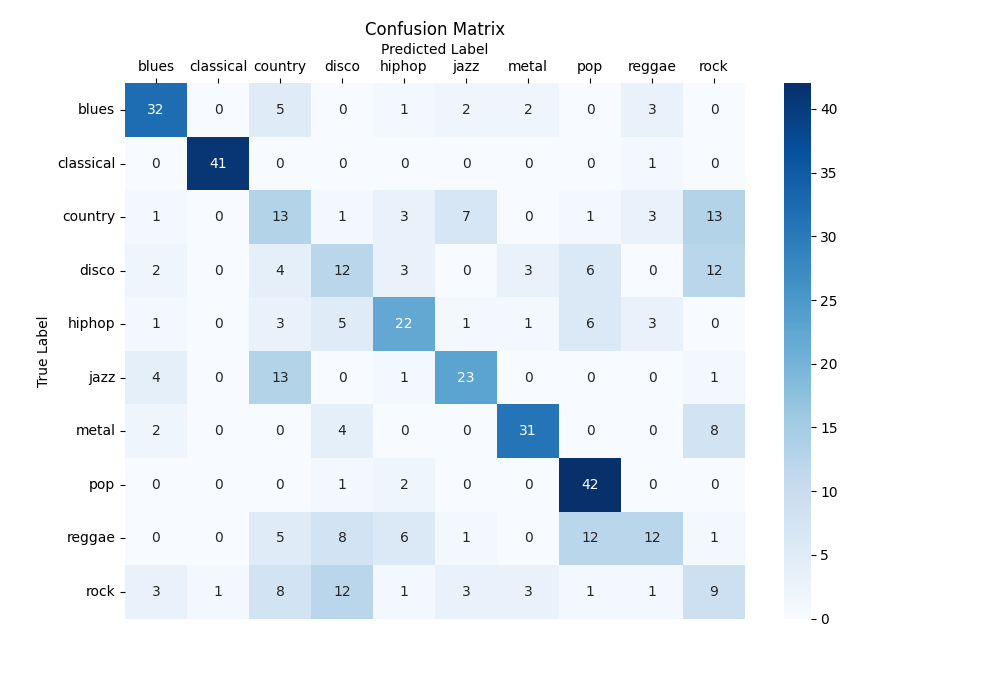

# Music Genre Classification Using kNN classifier
### Initial remarks
This project is based on [TTT4275 classification project](https://github.com/andrjust/TTT4275.git) by me and [@andrjust](https://github.com/andrjust) while taking the course [Estimation, Detection and Classification](https://www.ntnu.edu/studies/courses/TTT4275) at NTNU.
For this repository I have removed the unnecessary code and figures needed to comply with the task given to us in the course, leaving only the esentails for the optimal classifier.
## Description
In the projectIt we implement an k-nearest neigbour(kNN) classifier from scratch. The classifier is then trained on the [GTZAN Dataset for music classification](https://huggingface.co/datasets/marsyas/gtzan).
The dataset contains music from 10 different genres in for of features extracted from the sound files. Based on these features the classifier is trained in order to predict the genre of a given song.

The kNN classifies a song by looking at the k other song that are the most similar to it. It then choses the genre that is most likely. 

### Features
- Cross validation search for the best features to use for classification.
- Cross validation search for the optimal k.
- Weighted voting.

## Results

The model predicts with a 55.67\% accuracy. Bellow the confusion matrix for the project is shown:

